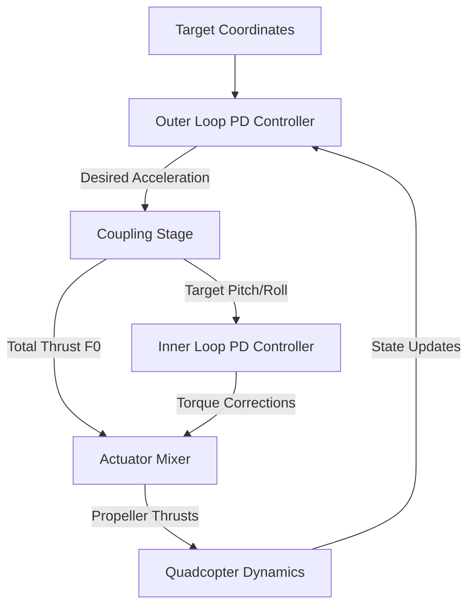

# 3D Quadcopter Physics Simulator & 3D Trajectory Visualizer

This document details the mathematical models, flight controller architecture, and visualization tools for the raw quadcopter simulation.

---

## State Vector Architecture

The state vector is a 10-dimensional numpy array tracked at each timestep:

$$\mathbf{x} = \begin{bmatrix} x & v_x & y & v_y & z & v_z & \phi & \omega_{\phi} & \theta & \omega_{\theta} \end{bmatrix}^T$$

Where:
- $x, y, z$: Spatial positions in meters.
- $v_x, v_y, v_z$: Linear velocities in m/s.
- $\phi$: Pitch angle in radians (rotation about the Y-axis).
- $\theta$: Roll angle in radians (rotation about the X-axis).
- $\omega_{\phi}, \omega_{\theta}$: Pitch and roll angular rates in rad/s.

---

## Physics & Simulation Assumptions

To simplify the physics modeling, the following assumptions are made for the drone and environment:
- **Geometry & Mass Distribution**: The drone is modeled as a uniform flat disk, with a moment of inertia of $I = 0.5 \cdot M \cdot R^2$ (where $M$ is the mass and $R$ is the arm length).
- **Locked Axis of Rotation**: Yaw (rotation about the Z-axis) is locked/disabled. Only pitch ($\phi$) and roll ($\theta$) degrees of rotational freedom are simulated.
- **Actuator Response**: Propellers respond instantly to control inputs to produce torque (no motor response delay or transition dynamics).
- **Ideal Environment**: No external uncertainties, wind gusts, or sensor noise are simulated. The drone responds exactly as commanded and its state is known with absolute certainty.
- **Force Representation**: Propellers act as pure point force vectors rather than physical rotating objects (aerodynamic side-effects like blade element aerodynamics, ground effect, and gyroscopic precession are neglected).

---

## Cascade Control Architecture

The quadcopter is stabilized and driven to target coordinates using a two-stage cascade controller:



### 1. Outer Loop Controller (Position Control)
Computes the desired 3D acceleration vectors to drive the drone to the target position:
- $a_{x,d} = \text{clip}(-k_{p,x} \cdot (x - x_0) - k_{v,x} \cdot v_x, -10, 10)$
- $a_{y,d} = \text{clip}(-k_{p,y} \cdot (y - y_0) - k_{v,y} \cdot v_y, -10, 10)$
- $a_{z,d} = \text{clip}(-k_{p,z} \cdot (z - z_0) - k_{v,z} \cdot v_z, -10, 10)$

### 2. Coupling Stage (Thrust & Attitude Directives)
Derives the total thrust magnitude $F_0$ and the target orientation angles ($\phi_d, \theta_d$):
- $F_0 = M \cdot \sqrt{a_{x,d}^2 + a_{y,d}^2 + (a_{z,d} + g)^2}$
- $\phi_d = \text{atan2}(-a_{x,d}, a_{z,d} + g)$
- $\theta_d = \text{atan2}(-a_{y,d}, a_{z,d} + g)$

### 3. Inner Loop Controller (Attitude Control)
Computes corrective angular accelerations based on orientation errors:

$$
\text{error}_{\phi} = -\text{atan2}\big(\sin(\phi - \phi_d), \cos(\phi - \phi_d)\big)
$$

$$
\text{error}_{\theta} = -\text{atan2}\big(\sin(\theta - \theta_d), \cos(\theta - \theta_d)\big)
$$

$$
\alpha_{\phi, d} = S_P \cdot \text{error}_{\phi} - S_D \cdot \omega_{\phi} - k_{\text{drag,rot}} \cdot \omega_{\phi} \cdot |\omega_{\phi}|
$$

$$
\alpha_{\theta, d} = S_P \cdot \text{error}_{\theta} - S_D \cdot \omega_{\theta} - k_{\text{drag,rot}} \cdot \omega_{\theta} \cdot |\omega_{\theta}|
$$


### 4. Actuator Mixer
Translates the desired attitude corrections and total thrust force into individual propeller forces ($T_1, T_2, T_3, T_4$) and clips them:
- $T_{p1} = \text{clip}(F_0 / 4 + \Delta F_x, T_{min}, T_{max})$ (Propeller positive X)
- $T_{p2} = \text{clip}(F_0 / 4 - \Delta F_x, T_{min}, T_{max})$ (Propeller negative X)
- $T_{t1} = \text{clip}(F_0 / 4 + \Delta F_y, T_{min}, T_{max})$ (Propeller positive Y)
- $T_{t2} = \text{clip}(F_0 / 4 - \Delta F_y, T_{min}, T_{max})$ (Propeller negative Y)

---

## Running the Simulator

Execute the simulation directly using the CLI:

```bash
# Run the default simulation (diagonal flight path)
python drone_simulation.py

# Select different flight path presets
python drone_simulation.py --scenario wild_spin
python drone_simulation.py --scenario straight_up

# Save the resulting 3D animation to an HTML file
python drone_simulation.py --save flight_animation.html --no-plot
```
